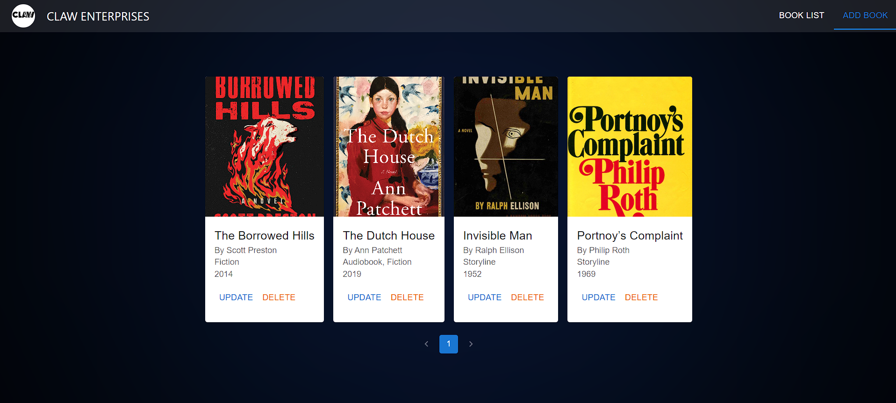

# Claw Enterprises 



# Table of Contents


## Project Overview

### Objective:
This project serves as a demonstration of full-stack development skills, evaluating proficiency in React.js for the front-end, Node.js with Express for the back-end, MongoDB for database storage, and REST APIs for communication between front-end and back-end.

### Task Description:
The task involves creating a full-stack web application for managing a collection of books. Users should be able to perform CRUD operations (Create, Read, Update, Delete) on books through the application.

### Features:

-Book Management Interface: Users can add, view, edit, and delete books. Each book includes fields for title, author, genre, and year published.
-Integration with Back-End: The front-end communicates with the back-end API to fetch, add, update, and delete book data using HTTP requests.

### Technologies Used:

-Front-End: React.js
-Back-End: Node.js, Express
-Database: MongoDB
-API: RESTful API

### Front-End Requirements:

Book Management Interface:
Develop a responsive user interface allowing users to interact with book data.
Utilize React.js components for modularity and maintainability.

### Back-End Requirements:

API Endpoints:

-Implement a RESTful API with endpoints for CRUD operations on books.

Endpoints include:

-GET /books
-GET /books/:id
-POST /books
-PUT /books/:id
-DELETE /books/:id
-Data Validation and Error Handling:
-Validate incoming data to ensure integrity.
-Handle errors gracefully and return appropriate HTTP status codes and messages.

### Database Requirements:

-Utilize MongoDB to store book data.
-Define data schema and interact with the database using Mongoose models.


## Getting Started

### Prerequisites

Before running the application, make sure you have the following installed:

- Node.js
- MongoDB or MongoDB Atlas account

### Installation

1. Clone the repository

```bash
git clone https://github.com/ryder-exe/Claw
```
2. Go to the project directory and install dependencies for both the Frontend and Backend

```bash
cd frontend
npm install
```

```bash
cd backend
npm install
```

3. Create a `.env` file `Backend` directories and add the environment variables as shown in the `.env.example` files.

4. Start the Frontend

```bash
cd frontend
npm run dev
```

5. Start the Backend

```bash
cd backend
npm start
```

#### `.env` Variables

For email service of context-based authentication, the following variables are required:

```bash
PORT= "Here give the PORT of the server in which you want to host backend"
URL= "Here provide the mongoDB database url"
```

#### Demo
https://youtu.be/Tmncayg7FeU


